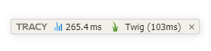
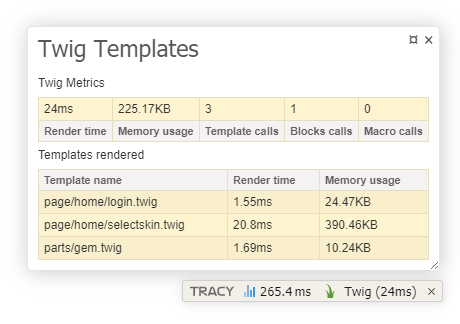

<!--suppress HtmlDeprecatedAttribute -->
<div align="center">

# IDMarinas Twig Tracy Bar


</div>

> Add Twig template info in the **Tracy** debugger bar.

<br />

<div align="center">

[][test-suit]
[](https://sonarcloud.io/summary/new_code?id=SONAR_PROJECT_NAME_CHANGE_ME)
[][sonarcloud]
[][sonarcloud]

<br />


#### Code analysis

[][sonarcloud]
[][sonarcloud]
[][sonarcloud]
[][sonarcloud]
[][sonarcloud]
[][sonarcloud]
[][sonarcloud]

</div>

> ## 🖖 Support
>
> 🩵 If you like this project, give it a 🌟 and share it with your friends!
>
> [](https://www.paypal.me/idmarinas)
> [](https://liberapay.com/IDMarinas/donate)
> [](https://github.com/sponsors/idmarinas)


<br />

<!-- readme-template -->





## Installation ##

### Composer ###

```bash
composer require --dev idmarinas/tracy-twig-bar
```

## Usage ##

Somewhere, when your application start and you initialize Twig engine

```php
use Idmarinas\TracyPanel\TwigBar;
use Idmarinas\TracyPanel\Twig\TracyExtension;
use Twig\Environment;
use Twig\Extension\ProfilerExtension;
use Twig\Profiler\Profile;

// ...
$profile = new Profile();
$env = new Environment($loader, $options);
$env->addExtension(new ProfilerExtension($profile));

/**
 * Optional Twig Extension.
 *
 * Can use `dump`, `dumpe` and `bdump` functions of Tracy
 */
$env->addExtension(new TracyExtension()); //-- Optional

TwigBar::init($profile);
```

<!-- readme-template -->

## 🖱️ Tech used in code


[](https://www.php.net)

## 🛠️ Tools used to create this project


[](https://github.com/features/actions)
[](https://www.docker.com)
[](https://getcomposer.org)

## 💬 Social

[](https://x.com/idmarinas)
[](https://discord.gg/FXEZqpF)

[//]: # (@formatter:off)
[sonarcloud]: https://sonarcloud.io/dashboard?id=SONAR_PROJECT_NAME_CHANGE_ME
[test-suit]: https://github.com/idmarinas/tracy-twig-bar/actions/workflows/php.yml
